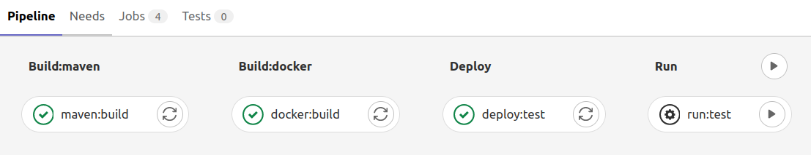
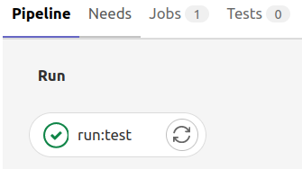

# Kafka Dlq Consumer Task Sample


## Getting started

This sample illustrates how to run a task that consumes a dead letter queue from a Kafka topic.
The main app, as shown in the next code snippet, runs the task and when lag of consumer group is equals to zero terminates the 
service:

 ```
public void run(String... args) {
    dlqConsumer.runConsumer();
    dlqConsumer.shutdown();
    log.info("task finished");
    shutdownApp();

}
```

## Include your business logic

This sample does not implement the part of the business logic related to the event process. The main purpose of consuming an event from a dead letter queue is to be able to 
re-insert it into the source origin once the problem that caused the error has been fixed. The idea is then to replace this code snipped by your own business logic:

 ```
  for (ConsumerRecord<byte[], byte[]> record : partitionRecords) {
    processEvent(record);
  }
 ```

## How to launch the task

Fist step is configure your service and the Gitlab project to allow it to be deployed.

### Configure the project

The only variable that depends on the environment is the BOOTSTRAP_SERVERS, so you need to set that in the task definition in the IaC project.
To run this locally you can set a default value as it's shown below:

      bootstrap-servers: ${BOOTSTRAP_SERVERS:localhost:9092}

On the other hand, you need to set the rest of variables related to kafka directly in the application.yml:

```
 kafka:
  topics: foo
  consumer:
  auto-offset-reset: latest
  bootstrap-servers: ${BOOTSTRAP_SERVERS:localhost:9092}
  group-id: ${spring.application.name}
  enable-auto-commit: false
  value-deserializer: org.apache.kafka.common.serialization.ByteArrayDeserializer
  key-deserializer: org.apache.kafka.common.serialization.ByteArrayDeserializer`
```

### Configure Gitlab Project

Due to the pipeline allows execution for multiple environments, configuration parameters must also be set for each environment that needs to be deployed.

The Gitlab CI/CD pipeline require the following parameters to be fully executed according the environment:

| Environment Variable                  | Description |
| :---                                  | :---- |
| **\<ENVIRONMENT>_TARGET_ROLE**        | This value requires the role ARN deployed by IaC which allows create new task definitions and run Fargate jobs |  
| **\<ENVIRONMENT>_AWS_SUBNET**         | To run Fargate job you must specify a subnet list | 
| **\<ENVIRONMENT>_AWS_SECURITY_GROUP** | A security group list is required To run Fargate tasks | 

* The ENVIRONMENT can typically be set to: TEST, PRE, PROD.

### Pipelines

It has been configured a `gitlab-ci` with two pipeline flows: 

* There is one flow intended to update the AWS Fargate task definition deployed by 
  [IaC project](https://source.tui/dx/fulfillment/ermes/iac-kafka-dlq-consumer-task)  
  Optionally, you can manually run the recently updated Fargate task with a last step as it's described in the  picture bellow. 
  This pipeline is triggered from branch you push commit.

    

* There is  a second flow that just runs automatically the AWS Fargate task. This pipeline is only activated using Gitlab web interface.

  


